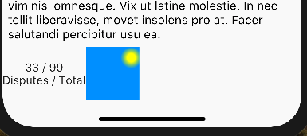

# InkWell Semantics

In this section, I will try to implement the following ReviewButton widget:


However, we also take inspiration from the implementation of the `ListTile` component and introduce ourselves to the new `InkWell` and `Semantics` classes from the material widget library

We will be going over the following `Widget`s:

- `InkWell`
- `Semantics`
- `ConstrainedBox`
- `UnconstrainedBox`
- `SafeArea`
- `ClipOval`
- `CustomPaint`
- `Canvas`

>Protip: press cmd + shift + v to preview markdown files in VS Code

Strap in, this will be a pretty complicated section!

## InkWell

An [InkWell](https://docs.flutter.io/flutter/material/InkWell-class.html) is a "tagless" material object which responds to gestures (like taps and long-presses) and it causes the little ripple effect that we associate with material buttons.

## Semantics

[Semantics](https://docs.flutter.io/flutter/widgets/Semantics-class.html) is purely annotation for the mobile based material design, think of it like ARIA except built for mobile

## SafeArea

Recall that the iPhone X has that weird thing at the top where the OS can intrude on the app. The [SafeArea](https://docs.flutter.io/flutter/widgets/SafeArea-class.html) guards against this:


## UnconstrainedBox

The [UnconstrainedBox](https://docs.flutter.io/flutter/rendering/RenderUnconstrainedBox-class.html) is a component that will render its child to its child's natural size, and throw out visual error bars when the child is clipped or overflowing. Judging from how `ListView` is using it, it seems to be best practice when creating a generalized widget that will contain child widgets

## ConstrainedBox

A box must be given `BoxConstraints`. Note that these things are not the "opposite" of `UnconstrainedBox` widgets 

See all of this working together in the implementation of `ListView`:

```dart
return new InkWell(
  onTap: enabled ? onTap : null,
  onLongPress: enabled ? onLongPress : null,
  child: new Semantics(
    selected: selected,
    enabled: enabled,
    child: new ConstrainedBox(
      constraints: new BoxConstraints(minHeight: tileHeight),
      child: new Padding(
        padding: const EdgeInsets.symmetric(horizontal: 16.0),
        child: new UnconstrainedBox(
          constrainedAxis: Axis.horizontal,
          child: new SafeArea(
            top: false,
            bottom: false,
            child: new Row(children: children),
          ),
        ),
      )
    ),
  ),
);
```

## CustomPaint

The [custom paint](https://docs.flutter.io/flutter/widgets/CustomPaint-class.html) allows me to more readily paint arbitrary canvas colors to the mobile device. 



Use the `CustomPaint` component if one desires to draw something more customized onto the screen like so:

```dart
Widget _buildPieChart() {
  return new Row(
    children: <Widget>[
      new CustomPaint(
        size: const Size(45.0, 45.0),
        painter: new PiePainter(sliceAngle: PI / 4)
      )
    ],
  );
}
```

The `size` argument is the pixel size of the custom canvas area that you can paint onto. Anything outside of that canvas will be cropped. The `Painter` is your own instance of the `CustomPainter` class with which we will use to paint our pie chart

## CustomPainter
The [CustomPaint](https://docs.flutter.io/flutter/rendering/CustomPainter-class.html) is the main interface with which we can use to draw onto the canvas on the screen:

```dart
class PiePainter extends CustomPainter {
  /// The angle in radians of the arc slice
  final double sliceAngle;

  const PiePainter({
    Listenable repaint,
    this.sliceAngle: 0.0
  }) : super(repaint: repaint);

  @override
  void paint(Canvas canvas, Size size) {
    final Paint greenPaint = new Paint()..color = Colors.green;
    final Paint redPaint = new Paint()..color = Colors.red;
    final double radius = min(size.width, size.height) / 2;
    final Offset center = new Offset(size.width / 2, size.height / 2);

    canvas.drawCircle(center, radius, greenPaint);

    final Rect rect = Offset.zero & size;
    const double startAngle = - PI / 2;

    canvas.drawArc(rect, startAngle, sliceAngle, true, redPaint);
  }

  @override
  bool shouldRepaint(PiePainter oldDelegate) => false;
}
```

Because we are custom-painting, it is now our duty to ensure that we mark when the painter should repaint, and on top of that, we must implement our own `paint` method that will work the canvas

## Canvas
The [Canvas](https://docs.flutter.io/flutter/dart-ui/Canvas-class.html) is initialized and passed to us by the `CustomPaint` component which we use. In our case, a bit of geometry is necessary to figure out how to draw arcs and circles.

The `Paint` object passed as the last argument to `drawCircle` and `drawArc` are how we specify to the `canvas` whether we should stroke, fill, gradient, or whatever other way of coloring we intend on our objects.

Also, notice the snippet:

```dart
final Rect rect = Offset.zero & size;
```

Apparently, the `Offset` class implements the custom operator `&` for us such that given an offset and a size, it automatically interprests a `Rect` object for us. Circle, on the other hand, are not calculated as nicely, and we are responsible for figuring out our own radii and center

Finally, notice that I specify:

```dart
const double startAngle = -PI / 2;
```
Firstly, we note that all angles in `dart` are specified in radians, not degrees. Next, the negative must be there because recall by convention that `0` radians is the x axis, thus we need to go back `- PI / 2` to be on the `y` axis (which is traditionally where pie charts start out in my specs).

All together, we have:


## Covariant Keyword
https://www.dartlang.org/guides/language/sound-problems#the-covariant-keyword