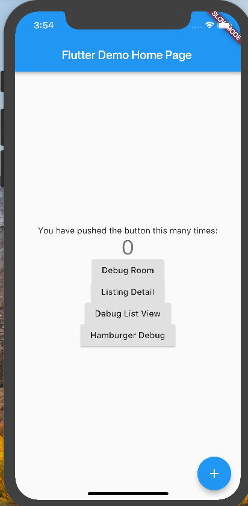
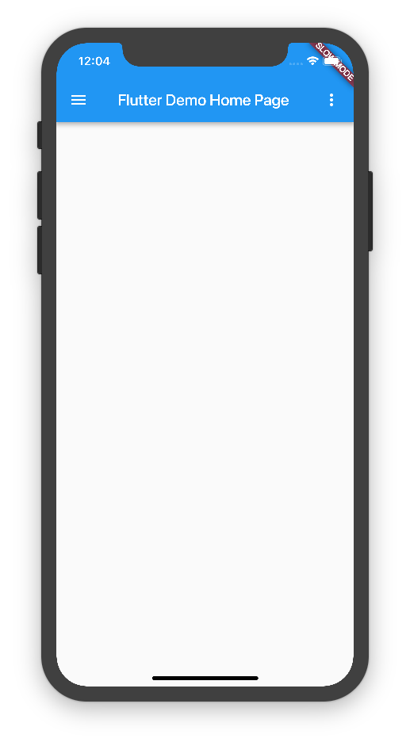

# Background

Until recently, I did not have a home page design, and as such, I was able to default my home page to my debug page:

However, with the design of my home page:

I am now ready to follow the usual convention of relegating my debug route to its own debug page.